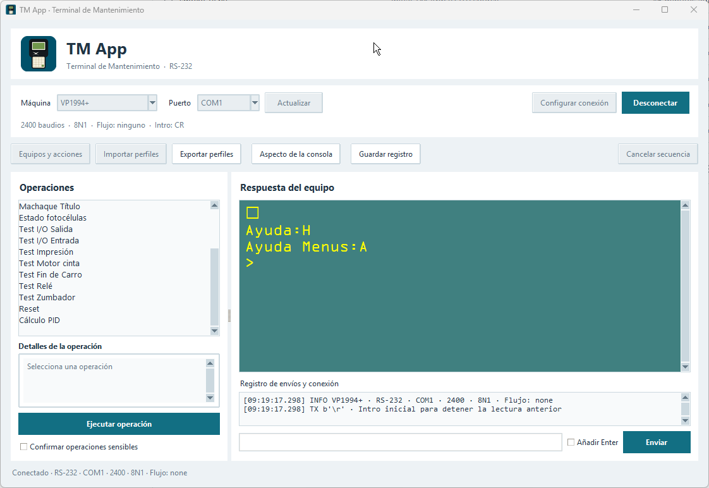

<div align="center">


# TM App

**Terminal de mantenimiento para comunicar con máquinas por puerto serie.**

Windows · Portable · Perfiles por equipo · Grabación de macros

[Guía de uso](docs/GUIA.md) · [Versiones](https://github.com/MrDerekib/tm-app/releases) · [Notas de versión](CHANGELOG.md)

</div>

TM App es una alternativa a HyperTerminal para trabajar con equipos mediante
comandos de texto por puerto serie. Combina una consola con operaciones guardadas,
secuencias de teclas y macros para repetir tareas habituales de mantenimiento.



## Qué puedes hacer

| Herramienta | Qué permite |
| :--- | :--- |
| **Consola serie** | Envía comandos manualmente y consulta las respuestas del equipo en tiempo real. |
| **Perfiles independientes** | Cada máquina tiene su propia conexión y su lista de operaciones. |
| **Secuencias de comandos** | Ejecuta operaciones guardadas con un botón, doble clic o Intro. |
| **Grabación de macros** | Captura teclas, asigna un nombre y ajusta las pausas entre pulsaciones. También puedes pedir valores al ejecutar. |
| **Perfiles compartidos** | Exporta e importa equipos completos o solo los comandos que necesites, eligiendo el perfil de destino. |
| **Consola a tu gusto** | Personaliza la tipografía, el tamaño del texto y los colores. |
| **Registro de sesión** | Guarda los envíos y las respuestas para revisarlos después. |

## Empezar

1. Abre **TM App**, selecciona tu equipo y configura su conexión serie.
2. Pulsa **Conectar** y escribe comandos en la entrada de texto o ejecuta una operación guardada.
3. Para crear tus propias operaciones, abre **Equipos y acciones → Grabar nuevo comando**.

## Sin instalación

El ejecutable no necesita instalador ni Python. Al abrirlo, crea la carpeta `datos`
a su lado para guardar tus perfiles y preferencias:

```text
TM App/
├── TM App.exe
└── datos/
```

Para llevarte la app a otro PC, copia **toda la carpeta**. Para actualizar,
sustituye únicamente el exe y conserva `datos`.

Las versiones del ejecutable se publicarán en [Releases](https://github.com/MrDerekib/tm-app/releases).

## Más información

La [guía de uso](docs/GUIA.md) recoge los detalles de las macros, los perfiles y
la ejecución desde Python. Para compilar y publicar el ejecutable, consulta
[RELEASING.md](RELEASING.md).
